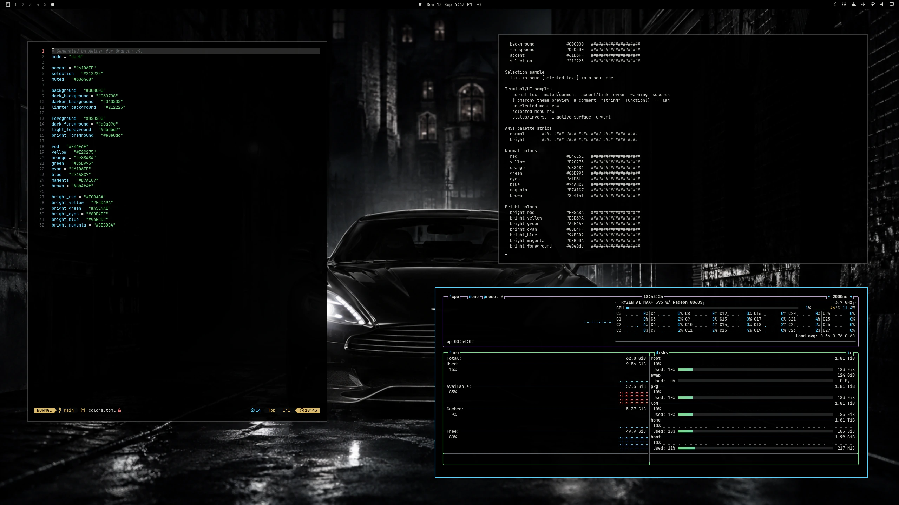
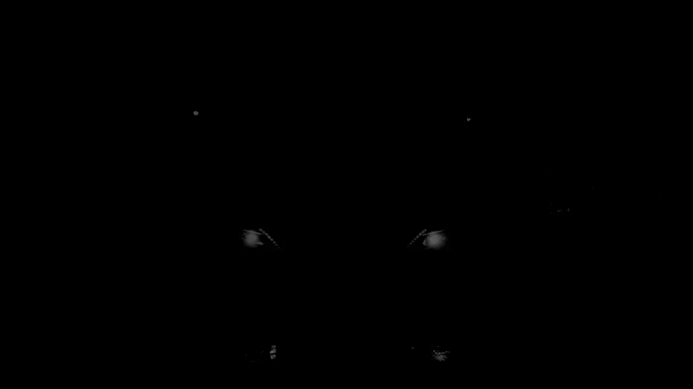

# Omarchy Carbon Black Theme

A carbon-black theme for [Omarchy](https://omarchy.org/), inspired by the incredible Aston Martin Vanquish Carbon Black edition and DHH's [Zonda Zoom](https://github.com/dhh/omarchy-zonda-zoom-theme) Omarchy theme. OLED-friendly pure-black primary surfaces are layered with near-black charcoal, soft gray text, and cool cyan accents.

This is the car the devil himself would drive. If he's not in the Batmobile, Bruce Wayne is in this — darkness and vengeance on four wheels, with menace sculpted into every line.



## Animated concept



This looping concept starts near black, brings the headlights up through the
fog, reveals the lighter standard scene, and then recedes into darkness. It is
a visual prototype only; installing the theme still uses static wallpapers.

Regenerate the preview with FFmpeg:

```sh
./scripts/render-animated-preview.sh
```

## Install

Requires Omarchy v4 with `colors.toml` theme support and the `Yaru-blue` icon theme.

```sh
omarchy theme install https://github.com/willspiering/omarchy-carbon-black-theme
```

## Palette

| Role | Hex |
| --- | --- |
| Background | `#000000` |
| Dark background | `#060708` |
| Darker background | `#040505` |
| Lighter background | `#212223` |
| Foreground | `#D5D5D0` |
| Accent | `#61D6FF` |
| Selection | `#212223` |
| Muted | `#606468` |

Full palette in [colors.toml](colors.toml). Icons are `Yaru-blue`.
Omarchy generates application colors from the palette using its built-in templates.

## Shell accents

The included [shell.toml](shell.toml) carries cyan into active and selected
shell states, including toggles, plugin controls, menus, notifications, and
the image picker. User overrides in `~/.config/omarchy/shell.toml` still take
precedence, and the theme does not set shell sizing, spacing, or typography.

## Wallpapers

Eight wallpapers are included in [backgrounds/](backgrounds/): four carbon-black designs and four smoke variants, all at 1672 × 941.

Cycle through them with:

```sh
omarchy theme bg next
```
